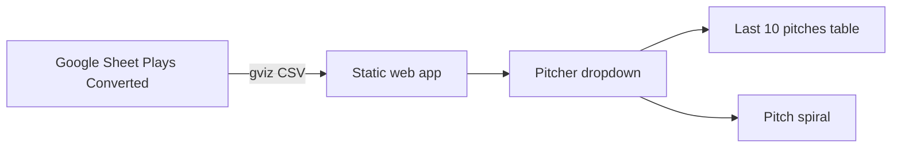

# RLN Charts Dashboard

## Overview

Tornado Scouting is a client-side dashboard that reads play-by-play data from a public Google Sheet and renders pitcher-focused views in the browser. It is designed for GitHub Pages hosting with no backend.

## Architecture

## Data contract

| Setting | Value |
| --- | --- |
| Spreadsheet ID | `1lcgT6np-4O5x83b2JZXjv8REfNDYXE7GMYMZeu5znRY` |
| Tab | `Plays (Converted)` |
| Filter field | `Pitcher` (sheet column I) |
| Pitch number field | `Pitch #` (sheet column J), scale 1–1000 |
| Fetch URL | `https://docs.google.com/spreadsheets/d/{id}/gviz/tq?tqx=out:csv&sheet=Plays%20(Converted)` |

The app maps CSV headers to row objects and filters rows where `Pitcher` equals the selected dropdown value. Both charts use the selected pitcher. The first pitcher in the sheet is selected by default on load.

## File map

| File | Responsibility |
| --- | --- |
| `index.html` | Page shell and chart container |
| `styles.css` | Layout, table, spiral, and legend theme |
| `config.js` | Sheet ID, tab name, filter column |
| `app.js` | CSV fetch/parse, filter logic, table and spiral rendering |

## Charts

### Chart 1 — Last 10 pitches (table)

Shows the 10 most recent pitches for the selected pitcher, sorted chronologically by `Play` (most recent first).

| Column | Source field |
| --- | --- |
| Pitch # | `Pitch #` |
| Result | `Result` |
| Batter | `Batter` |
| Inning | `Inning` |

Rows without a valid pitch number (1–1000) are excluded.

### Chart 2 — Pitch spiral

Shows **all pitch history** for the selected pitcher, including result type as node color.

| Element | Behavior |
| --- | --- |
| Angular position | `pitch # × 360 ÷ 1000` degrees clockwise from top center (500 at bottom, 250 at right). |
| Radial position | Oldest pitch near the center; each later pitch is placed farther out with wide radial spread. |
| Node color | Each `Result` value maps to a distinct color; legend shown below the chart. |
| Connectors | Smooth paths interpolated through the midpoint pitch number and radius, taking the shortest route around the 0/1000 boundary. |
| Labels | Each point shows its pitch number inside the colored bubble; the most recent pitch has a white ring. |
| Legend | Result color key is layered over the top of the spiral chart. |
| Guides | Radial lines and labels at every 100 on the pitch scale (0/1000, 100, 200, …). |
| Zoom | Scroll to zoom from center; high-resolution canvas redraw keeps detail sharp. |

Guide labels appear at every 100 on the pitch scale. Chronological order uses the `Play` field.

## Extending charts

1. Add a render function in `app.js`.
2. Register it in `renderDashboard`.
3. Use the filtered pitcher rows passed into each renderer.

Example fields available on each play row:

- `Game`, `Inning`, `Play`, `Outs`, `BRC`, `OFF`, `DEF`
- `PlayType`, `Pitcher`, `Pitch #`, `Batter`, `Swing #`
- `Catcher`, `Throw #`, `Runner`, `Steal #`, `Result`, `Runs`
- `Pitcher ID`, `Batter ID`, `Catcher Id`, `Runner ID`, `Diff`, `Session #`

## Deployment checklist

- [x] Push repo to GitHub
- [ ] Enable GitHub Pages from `main` / root
- [ ] Confirm sheet remains publicly readable
- [x] Define and implement Chart 3

## Notes

- No API key is required because the sheet is public and fetched through Google's CSV export endpoint.
- Data refresh happens on page load. Add a refresh button or interval polling later if needed.
- Charts are rendered with native DOM and canvas.
