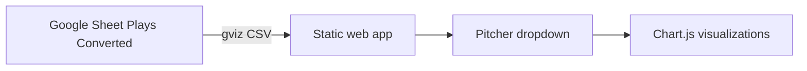

# RLN Charts Dashboard

## Overview

RLN Charts is a client-side dashboard that reads play-by-play data from a public Google Sheet and renders filter-driven charts in the browser. It is designed for GitHub Pages hosting with no backend.

## Architecture

## Data contract

| Setting | Value |
| --- | --- |
| Spreadsheet ID | `1lcgT6np-4O5x83b2JZXjv8REfNDYXE7GMYMZeu5znRY` |
| Tab | `Plays (Converted)` |
| Filter field | `Pitcher` (sheet column I) |
| Fetch URL | `https://docs.google.com/spreadsheets/d/{id}/gviz/tq?tqx=out:csv&sheet=Plays%20(Converted)` |

The app maps CSV headers to row objects and filters rows where `Pitcher` equals the selected dropdown value. Selecting **All pitchers** removes the filter.

## File map

| File | Responsibility |
| --- | --- |
| `index.html` | Page shell and chart container |
| `styles.css` | Layout and theme |
| `config.js` | Sheet ID, tab name, filter column |
| `app.js` | CSV fetch/parse, filter logic, chart rendering |

## Current charts

These are starter charts intended to be replaced once final requirements are defined:

1. **Results breakdown** — count of `Result` values
2. **Play types** — distribution of `PlayType`
3. **Runs allowed** — summed `Runs` by `Game`

## Extending charts

1. Add a builder function in `app.js` (or split into `charts.js` later).
2. Register it in the `chartDefinitions` array inside `renderPlaceholderCharts`.
3. Use the filtered `rows` array passed into each builder.

Example fields available on each play row:

- `Game`, `Inning`, `Play`, `Outs`, `BRC`, `OFF`, `DEF`
- `PlayType`, `Pitcher`, `Pitch #`, `Batter`, `Swing #`
- `Catcher`, `Throw #`, `Runner`, `Steal #`, `Result`, `Runs`
- `Pitcher ID`, `Batter ID`, `Catcher Id`, `Runner ID`, `Diff`, `Session #`

## Deployment checklist

- [ ] Push repo to GitHub
- [ ] Enable GitHub Pages from `main` / root
- [ ] Confirm sheet remains publicly readable
- [ ] Replace placeholder charts with final chart specs

## Notes

- No API key is required because the sheet is public and fetched through Google's CSV export endpoint.
- Data refresh happens on page load. Add a refresh button or interval polling later if needed.
- Chart definitions are intentionally simple so they can be swapped without changing the data-loading layer.
