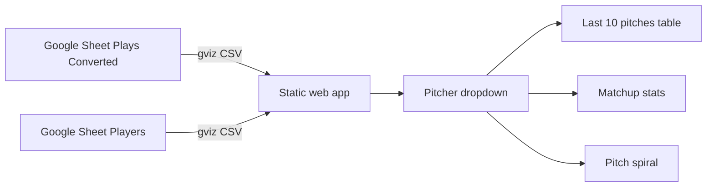

# RLN Charts Dashboard

## Overview

Tornado Scouting is a client-side dashboard that reads play-by-play data from a public Google Sheet and renders pitcher-focused views in the browser. It is designed for GitHub Pages hosting with no backend.

## Architecture



## Data contract

| Setting | Value |
| --- | --- |
| Spreadsheet ID | `1lcgT6np-4O5x83b2JZXjv8REfNDYXE7GMYMZeu5znRY` |
| Plays tab | `Plays (Converted)` |
| Players tab | `Players` |
| Player import tab | `import_players` (uses expanded rows when present; otherwise follows the **Player Universe** IMPORTRANGE to `Players`) |
| Filter field | `Pitcher` (plays column I) |
| Pitch number field | `Pitch #` (plays column J), scale 1–1000 |
| Plays fetch URL | `https://docs.google.com/spreadsheets/d/{id}/gviz/tq?tqx=out:csv&sheet=Plays%20(Converted)` |
| Players fetch URL | `https://docs.google.com/spreadsheets/d/{id}/gviz/tq?tqx=out:csv&sheet=Players` |

The app maps CSV headers to row objects and filters rows where `Pitcher` equals the selected dropdown value. The batter dropdown lists batters faced by the selected pitcher (defaulting to the most recent). Matchup stats are looked up by matching `Government Name` (column D) to the selected pitcher and batter, merged from the `Players` tab and `import_players` (including the IMPORTRANGE player universe when that tab only contains import formulas). All charts use the selected pitcher. The first pitcher in the sheet is selected by default on load. Use **Sync sheet** in the controls bar to fetch the latest CSV from both tabs on demand; the selected pitcher is preserved when possible.

## Situation panel and range table

The **Situation** panel sits above the chart grid. It drives the **Range table** card:

| Control | Purpose |
|---------|---------|
| Diamond base pickers (1st / 2nd / 3rd) | Radio: Empty or Runner on each base |
| Outs | Radio: 0, 1, or 2 outs |

The range table is computed client-side from stadium calculator logic (`rangeEngine.js` + `calculator-tables.js`):

- Uses selected pitcher/batter ratings and handedness for base range sizes (normal swing only; bunts excluded).
- Pitcher **MOV** is shown in matchup stats but is **not** used in Hit/K rating deltas (matches the stadium calculator, where cell X3 is empty).
- Splits sub-results (for example `2BWH`, `1BWH`, `FO`) based on the chosen runner configuration.
- Shown under **Matchup** in the top chart row (Last 10 pitches | Matchup + Range table).
- Columns: **Result**, **Down**, **Up**.
  - Hypothetical Swing **off**: `Down = -high>`, `Up = <high` (cumulative diff bounds); **K** shows `—` in both columns
  - Hypothetical Swing **on** (with a swing value): `Down` / `Up` = swing ± cumulative high (0–1000); **K** still shows `—`

Re-export embedded calculator constants after stadium sheet changes:

```bat
python scripts\export-calculator-data.py
```

Then copy any updated values into `calculator-tables.js`.

## File map

| File | Responsibility |
| --- | --- |
| `index.html` | Page shell and chart container |
| `styles.css` | Layout, table, spiral, and legend theme |
| `config.js` | Sheet ID, tab names, filter column, player column indices |
| `app.js` | CSV fetch/parse, filter logic, table, stats, and spiral rendering |

## Charts

### Chart 1 — Last 10 pitches (table)

Shows the 10 most recent pitches for the selected pitcher, sorted chronologically by `Play` (most recent first). Displayed beside the Matchup chart in a shared top row.

| Column | Source field |
| --- | --- |
| Pitch | `Pitch #` |
| Swing | `Swing #` |
| Result | `Result` |
| Batter | `Batter` |
| Inning | `Inning` |

Rows without a valid pitch number (1–1000) are excluded.

### Chart 1b — Matchup (compact list)

Shows pitcher and batter ratings side by side for the selected matchup. Stats come from the **Players** tab, matched on `Government Name`.

| Side | Stat columns |
| --- | --- |
| Pitcher | Hand (J), MOV (O), CMD (P), VEL (Q), AWR (R) |
| Batter | Hand (J), CON (K), EYE (L), POW (M), SPD (N) |

Displayed as a narrow vertical list beside the last-10-pitches table.

### Chart 2 — Pitch spiral

Shows **all pitch history** for the selected pitcher, including result type as node color.

| Element | Behavior |
| --- | --- |
| Angular position | `pitch # × 360 ÷ 1000` degrees clockwise from top center (500 at bottom, 250 at right). |
| Radial position | Oldest pitch near the center; each later pitch is placed farther out with wide radial spread. |
| Node color | Raw `Result` codes are grouped into categories: **Base Hit** (blue), **Out** (orange), **Strikeout** (red), **Home Run** (green), and **Other** (gray). |
| Connectors | Smooth paths interpolated through the midpoint pitch number and radius, taking the shortest route around the 0/1000 boundary. Solid lines connect consecutive pitches; dotted lines mark inning changes; dashed lines mark game changes. |
| Labels | Each point shows its pitch number inside the colored bubble; the most recent pitch has a white ring. |
| Legend | Result categories and transition line styles sit above the chart (not overlaid on the canvas). |
| Guides | Radial lines and labels at every 100 on the pitch scale (0/1000, 100, 200, …). |
| Zoom | Scroll to zoom from center; high-resolution canvas redraw keeps detail sharp. |
| Hypothetical swing | Optional control: check **Hypothetical Swing**, enter a swing number (0–1000), then click **Simulate Swing**. Draws a light-red target at that swing angle on the outer radius plus a straight line to the center. Clears when unchecked or when the pitcher changes. |
| Range markers | When **Hypothetical Swing** is active, each bracket band fills a thin annular slice (about one-quarter the previous thickness) on the outer guide with 25%-opacity color and 75%-opacity boundary ticks. Each tick is labeled with its pitch number in the matching color. Result codes label the bands (`|1B|2B|3B|HR|3B|2B|1B|`, with red **K** in the outermost band). |

Guide labels appear at every 100 on the pitch scale. Chronological order uses the `Play` field. Hypothetical swing and range markers use the same angular scale as pitch/swing numbers (`swing # × 360 ÷ 1000`).

## Extending charts

1. Add a render function in `app.js`.
2. Register it in `renderDashboard`.
3. Use the filtered pitcher rows passed into each renderer.

Example fields available on each play row:

- `Game`, `Inning`, `Play`, `Outs`, `BRC`, `OFF`, `DEF`
- `PlayType`, `Pitcher`, `Pitch #`, `Batter`, `Swing #`
- `Catcher`, `Throw #`, `Runner`, `Steal #`, `Result`, `Runs`
- `Pitcher ID`, `Batter ID`, `Catcher Id`, `Runner ID`, `Diff`, `Session #`

## Deployment checklist

- [x] Push repo to GitHub
- [ ] Enable GitHub Pages from `main` / root
- [ ] Confirm sheet remains publicly readable
- [x] Define and implement Chart 3

## Notes

- No API key is required because the sheet is public and fetched through Google's CSV export endpoint.
- Data loads on page open. Click **Sync sheet** to refresh from the spreadsheet; manual sync bypasses browser cache with a cache-busting query parameter.
- Charts are rendered with native DOM and canvas.
