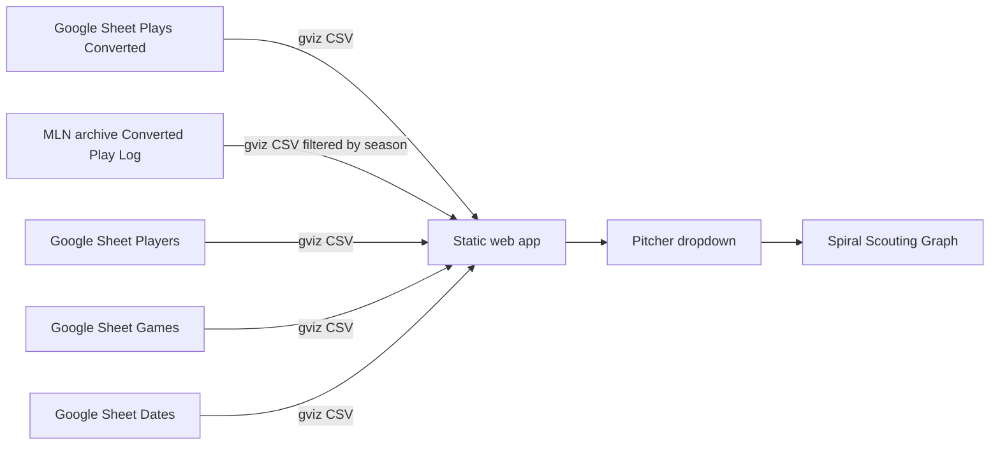

# RLN Charts Dashboard

## Overview

Tornado Scouting is a client-side dashboard that reads play-by-play data from a public Google Sheet and renders pitcher-focused views in the browser. It is designed for GitHub Pages hosting with no backend.

## Architecture



## Data contract

| Setting | Value |
| --- | --- |
| Spreadsheet ID | `1NQ4l0EjwFYVdIjlYIkycYfuWw_jdZKiWsNURTcTy4AA` (Export Tables) |
| Historical import guide | `10YijQ45zwO2uxws7HF1As46pz3dFnxv_qcI-EIvSXCg` ([MLN Data Import Guide](https://docs.google.com/spreadsheets/d/10YijQ45zwO2uxws7HF1As46pz3dFnxv_qcI-EIvSXCg/edit)) |
| Historical play archive | `1H9ES_TL9nC0x-Q3auM6jtLcb6bII--eu4MtcAPoFcqg` tab `Converted Play Log` (season 12+ via gviz query) |
| Plays tab | `Plays (Converted)` |
| Players tab | `Players` |
| Games tab | `Games` |
| Dates tab | `Dates` |
| Player import tab | `import_players` (uses expanded rows when present; otherwise follows the **Player Universe** IMPORTRANGE to `Players`) |
| Scout team | `SUN` |
| Filter field | `Pitcher` (plays column I) |
| Pitch number field | `Pitch #` (alias: `Pitch` on export tabs), scale 1–1000 |
| Plays fetch URL | `https://docs.google.com/spreadsheets/d/{id}/gviz/tq?tqx=out:csv&sheet=Plays%20(Converted)` |
| Players fetch URL | `https://docs.google.com/spreadsheets/d/{id}/gviz/tq?tqx=out:csv&sheet=Players` |

The app maps CSV headers to row objects and filters rows where `Pitcher` equals the selected dropdown value. **Live plays, players, games, and dates** come from the Export Tables sheet. **Historical play rows** for spiral delta overlays are fetched from the MLN archive (`Converted Play Log`, seasons **11–13** via gviz query) and merged with current-sheet plays for the same seasons. Season **13** comes from the current Export Tables sheet; seasons **11–12** come from the archive referenced by the [MLN Data Import Guide](https://docs.google.com/spreadsheets/d/10YijQ45zwO2uxws7HF1As46pz3dFnxv_qcI-EIvSXCg/edit). Rows are deduped by `Game` + `Play` with current-sheet rows winning overlaps. **Pitch charts and tables** use the merged seasons **11–13** dataset (not current-sheet rows alone), so pitchers with archive history still render when the live Export Tables tab is empty or sparse. Matsumoto-style overlays use the same merged pool. Live game lock, score, and situation inference still use current-sheet plays only. Matchup stats and player dropdowns continue to use the current Export Tables **Players** tab only.

## Scouting modes

| Mode | Pitcher dropdown | Batter dropdown | Game lock |
| --- | --- | --- | --- |
| **Live Scouting** (default) | Active pitchers on the opponent team for the locked SUN game | Active `SUN` roster players | Current live SUN game, or the next upcoming SUN game in the active session |
| **Speculation** | Any pitcher with play data | Any player in the roster import | None |

Live game resolution uses the **Dates** tab to find the current session (or the next upcoming session before the season starts) and the **Games** tab to find `SUN` matchups in that session. A game is treated as live when it has a `Start` time without `End`, or when converted plays exist for that `Game#` and the game is not finished. Otherwise the first unfinished SUN game in the session is used as the upcoming matchup. The controls bar shows the locked matchup label (for example `Upcoming: SUN @ HFX · Session 1 · vs HFX`). The spiral graph defaults to the pitcher’s last **3 games**; Matsumoto-style delta box-plot stats use the last **3 seasons** (derived from the first two digits of `Game#`).

Player rosters for live mode come from the **Players** tab (`Team`, `Status`, `Primary`). Opponent pitchers are filtered to `Primary = P`. SUN batters include all active SUN roster players.

## Situation panel and range table

The **Situation** panel shares a top row with **Matchup** and **Range table** (side by side on the right). The situation panel stretches to the same height as the range table; the diamond scales to fill that space while the matchup + range row keeps full width alignment with the chart cards below. It drives the **Range table** card:

| Control | Purpose |
|---------|---------|
| Diamond base pickers (1st / 2nd / 3rd) | Checkbox on each base (checked = runner on base) |
| Outs | Dropdown centered inside the diamond: 0, 1, or 2 outs |

In **Live Scouting** mode, the situation panel is hidden and a read-only base/out graphic is shown inside the **Matchup** card, inferred from the latest `SUN` offensive play in the locked game using the play sheet `BRC` runner mask and `Outs` columns. **Speculation** mode keeps the separate **Situation** panel with manual diamond controls.

The range table is computed client-side from stadium calculator logic (`rangeEngine.js` + `calculator-tables.js`):

- Uses selected pitcher/batter ratings and handedness for base range sizes (normal swing only; bunts excluded).
- Pitcher **MOV** is shown in matchup stats but is **not** used in Hit/K rating deltas (matches the stadium calculator, where cell X3 is empty).
- Splits sub-results (for example `2BWH`, `1BWH`, `FO`) based on the chosen runner configuration.
- Shown beside **Situation** in the dashboard top row, next to **Matchup**.
- Columns: **Result**, **Down**, **Up**.
  - Hypothetical Swing **off**: `Down = -high>`, `Up = <high` (cumulative diff bounds); **K** shows `—` in both columns
  - Hypothetical Swing **on** (with a swing value): `Down` / `Up` = swing ± cumulative high (0–1000); **K** still shows `—`

Re-export embedded calculator constants after stadium sheet changes:

```bat
python scripts\export-calculator-data.py
```

Then copy any updated values into `calculator-tables.js`.

## File map

| File | Responsibility |
| --- | --- |
| `index.html` | Page shell and chart container |
| `styles.css` | Layout, table, spiral, and legend theme (purple SUN palette) |
| `config.js` | Sheet ID, tab names, filter column, player column indices |
| `liveScouting.js` | Session/game resolution and live roster filtering for SUN matchups |
| `app.js` | CSV fetch/parse, filter logic, table, stats, and spiral rendering |

## Layout and charts

The header stacks two full-width panels above the spiral: a **Matchup** panel (pitcher and batter side by side, each with dropdown + one-line stats underneath) and **Live game** (score, situation diamond, sync status).

### Spiral Scouting Graph

Shows recent pitch history for the selected pitcher, including result type as node color. Defaults to the pitcher’s last **3 games**.

| Element | Behavior |
| --- | --- |
| Game window | Limits graph to the most recent 3 games by `Play` order; footer shows `N of total` when filtered. |
| Angular position | `pitch # × 360 ÷ 1000` degrees clockwise from top center (500 at bottom, 250 at right). |
| Radial position | Oldest pitch near the center; each later pitch is placed farther out with wide radial spread. |
| Node color | Raw `Result` codes are grouped into categories: **Base Hit** (blue), **Out** (orange), **Strikeout** (red), **Home Run** (green), and **Other** (gray). |
| Connectors | Smooth paths interpolated through the midpoint pitch number and radius, taking the shortest route around the 0/1000 boundary. Each segment uses the previous pitch's result color at 36% opacity. Inning and game transitions use neutral grey at 70% opacity (dotted/dashed) instead of result color. Solid lines connect consecutive pitches; dotted lines mark inning changes; dashed lines mark game changes. |
| Labels | Each point shows its pitch number inside the colored bubble; the most recent pitch has a white ring. |
| Outer Δ band | Uses Matsumoto logic on the last **3 seasons** of pitcher data. Takes the **latest pitch** in the spiral window, groups historical transitions by that result type, and draws min/Q1/median/Q3/max as an annular box plot on the outer guide ring, **centered on the latest pitch** angle. |
| Legend | Result categories, transition line styles, and the active outer Δ band sit above the chart (not overlaid on the canvas). |
| Guides | Radial lines and labels at every 100 on the pitch scale (0/1000, 100, 200, …). |
| Zoom | Scroll to zoom from center; high-resolution canvas redraw keeps detail sharp. |

Guide labels appear at every 100 on the pitch scale. Chronological order uses the `Play` field.

### Matsumoto stats (embedded in spiral)

Pitch-to-pitch signed deltas are grouped by the **current pitch** result type (**HR**, **Hit**, **Out**, **K**; **Other** excluded). Box-plot stats (min, Q1, median, Q3, max) are computed from the last 3 seasons and rendered as the outer annular band on the spiral for the latest pitch only.

## Extending charts

1. Add a render function in `app.js`.
2. Register it in `renderDashboard`.
3. Use the filtered pitcher rows passed into each renderer.

Example fields available on each play row:

- `Game`, `Inning`, `Play`, `Outs`, `BRC`, `OFF`, `DEF`
- `PlayType`, `Pitcher`, `Pitch #` (or `Pitch`), `Batter`, `Swing #` (or `Swing`)
- `Catcher`, `Throw #`, `Runner`, `Steal #`, `Result`, `Runs`
- `Pitcher ID`, `Batter ID`, `Catcher Id`, `Runner ID`, `Diff`, `Session #`

## Deployment checklist

- [x] Push repo to GitHub
- [ ] Enable GitHub Pages from `main` / root
- [ ] Confirm sheet remains publicly readable
- [x] Matsumoto delta stats embedded in spiral outer band

## Notes

- No API key is required because the sheet is public and fetched through Google's CSV export endpoint.
- Data loads on page open. Click **Sync sheet** to refresh from the spreadsheet; manual sync bypasses browser cache with a cache-busting query parameter.
- Charts are rendered with native DOM and canvas.
