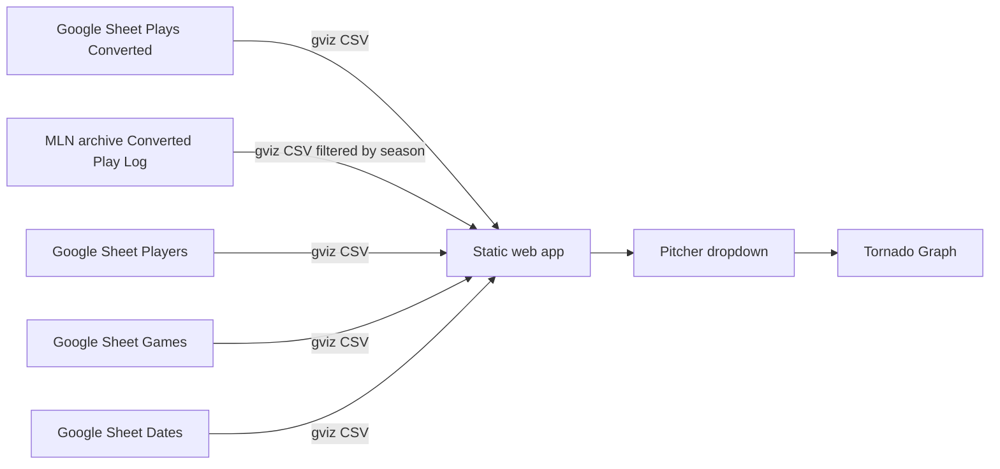

# RLN Charts Dashboard

## Overview

Tornado Scouting is a client-side dashboard that reads play-by-play data from a public Google Sheet and renders pitcher-focused views in the browser. It is designed for GitHub Pages hosting with no backend.

## Architecture



## Data contract

| Setting | Value |
| --- | --- |
| Spreadsheet ID | `1NQ4l0EjwFYVdIjlYIkycYfuWw_jdZKiWsNURTcTy4AA` (Export Tables) |
| Historical import guide | `10YijQ45zwO2uxws7HF1As46pz3dFnxv_qcI-EIvSXCg` ([MLN Data Import Guide](https://docs.google.com/spreadsheets/d/10YijQ45zwO2uxws7HF1As46pz3dFnxv_qcI-EIvSXCg/edit)) |
| Historical play archive | `1H9ES_TL9nC0x-Q3auM6jtLcb6bII--eu4MtcAPoFcqg` tab `Converted Play Log` (season 12+ via gviz query) |
| Plays tab | `Plays (Converted)` |
| Players tab | `Players` |
| Games tab | `Games` |
| Dates tab | `Dates` |
| Player import tab | `import_players` (uses expanded rows when present; otherwise follows the **Player Universe** IMPORTRANGE to `Players`) |
| Scout team | `SUN` |
| Filter field | `Pitcher` (plays column I) |
| Pitch number field | `Pitch #` (alias: `Pitch` on export tabs), scale 1–1000 |
| Plays fetch URL | `https://docs.google.com/spreadsheets/d/{id}/gviz/tq?tqx=out:csv&sheet=Plays%20(Converted)` |
| Players fetch URL | `https://docs.google.com/spreadsheets/d/{id}/gviz/tq?tqx=out:csv&sheet=Players` |

The app maps CSV headers to row objects and filters rows where `Pitcher` equals the selected dropdown value. **Live plays, players, games, and dates** come from the Export Tables sheet. **Historical play rows** for spiral delta overlays are fetched from the MLN archive (`Converted Play Log`, seasons **11–13** via gviz query) and merged with current-sheet plays for the same seasons. Season **13** comes from the current Export Tables sheet; seasons **11–12** come from the archive referenced by the [MLN Data Import Guide](https://docs.google.com/spreadsheets/d/10YijQ45zwO2uxws7HF1As46pz3dFnxv_qcI-EIvSXCg/edit). Rows are deduped by `Game` + `Play` with current-sheet rows winning overlaps. **Pitch charts and tables** use the merged seasons **11–13** dataset (not current-sheet rows alone), so pitchers with archive history still render when the live Export Tables tab is empty or sparse. Matsumoto-style overlays use the same merged pool. Live game lock, score, and situation inference still use current-sheet plays only. Matchup stats and player dropdowns continue to use the current Export Tables **Players** tab only.

## Scouting modes

| Mode | Pitcher dropdown | Batter dropdown | Game lock |
| --- | --- | --- | --- |
| **Live Scouting** (default) | Active/Captain pitchers on the opponent team for the locked SUN game | Active/Captain `SUN` roster batters (`Primary` ≠ `P`) | Current live SUN game, or the next upcoming SUN game in the active session |
| **Pitcher Mode** (checkbox) | Active/Captain `SUN` roster pitchers (`Primary = P`) | Active/Captain opponent batters (`Primary` ≠ `P`) | Same live game lock as Live Scouting |
| **Speculation** | Any pitcher with play data | Any player in the roster import | None |

Live game resolution uses the **Dates** tab to find the current session (or the next upcoming session before the season starts) and the **Games** tab to find `SUN` matchups in that session. A game is treated as live when it has a `Start` time without `End`, or when converted plays exist for that `Game#` and the game is not finished. Otherwise the first unfinished SUN game in the session is used as the upcoming matchup. The controls bar shows the locked matchup label (for example `Upcoming: SUN @ HFX · Session 1 · vs HFX`). The tornado graph shows the last **25** pitches while stats and overlays use all available seasons.

**First Pitch Mode** (checkbox beside the live situation diamond) filters all pitcher-scoped data to the earliest pitch per game for the selected pitcher. When active, a red banner appears on the situation box, pitch connectors are hidden, the **Next Pitch Range by Result** band is removed, and the value band becomes **First Pitches** centered on the widest empty arc between first-pitch numbers. A red **First Pitch Mode Active** label appears on the bottom-right of the spiral canvas.

**Pitcher Mode** (checkbox beside First Pitch Mode) flips the live roster dropdowns to scout **SUN pitching** against the locked opponent: the pitcher list shows eligible `SUN` pitchers and the batter list shows eligible opponent batters for **matchup stats**. Pitch history on the tornado graph uses all available pitches for the selected SUN pitcher (seasons 11–13), not filtered to the selected batter. The tornado graph hides the **Attack Zone**, **Recommended Swing** overlay, projected situation bands, and related legend entries. For each visible pitch with a `Swing #`, a **grey** line is drawn from the chart center to the point mapped from that swing number (same angle rule as pitch #) at the **same radial distance** as the pitch dot, so recency matches the pitch spiral. The **By Situation** Δ band (see below) is available in both modes. An **Export** button below the situation controls (visible in **both** modes) downloads a PNG of the full dashboard (`main.page`, including matchup header and tornado graph) via `html-to-image`. The capture adds a horizontal padding buffer so edge content is not clipped, and the Export button itself is excluded from the image.

In **Batter mode** (Pitcher Mode off), a single **Slayer Report** card appears between the situation header and the tornado graph. Both pitch/delta tables are anchored on the latest pitch’s 100-wide bucket (`floor(pitch # ÷ 100) × 100`, shown as e.g. `100's`) and count only sequences whose **previous pitch** falls in that anchor bucket. The first table is titled **Pitches after {bucket}** and buckets the current pitch number into 100-wide columns labeled `0's`, `100's`, `200's`, etc., with rows for all pitches and the last 100 pitches. The second, **Δ after {bucket}**, uses the same previous-pitch filter but buckets the **absolute** shortest-path delta to the next pitch into 50-wide columns labeled `0's`, `50's`, … `500's`. Every bucket column is shown (including empties). Cell values are expressed as a **percentage of the row total** (the **Total** column keeps the raw sample count), and the **top 4** buckets in each row are highlighted with red bubbles of decreasing opacity (darkest = most frequent). A third summary table (no section header) spans the same card width and shows the highest-percentage bucket per row (`Expected Pitch` from table 1, `Expected Δ` from table 2), with **Last 100** and **All Time** columns; ties pick the lowest bucket value. Its values **and headers** use the long bucket range form (`100-200` for the 100-wide pitch buckets, `100-150` for the 50-wide delta buckets) at a large display font size. The `Expected Pitch` / `Expected Δ` row labels use the muted color to match the **Last Pitch** label. A **Last Pitch** readout (the latest pitch number) sits in the top-right corner of the card at the same large font. At the very top of the card a **Favourites** table (which replaces the old inline *Favourite Pitches* / *Favourite Memes* lines) shows row 1 = favourite pitches in ranked order and row 2 = meme pitches in ascending pitch-number order; in both rows the four highest-count entries get the same red bubble highlighting (decreasing opacity) used by the bucket tables, with the raw count as a superscript. Pitch density curves and Matsumoto Δ bands remain available.

When **First Pitch Mode** is active, the Slayer Report panel adapts: pitcher data is already filtered to the first pitch of each game, so the pitch table is titled **First Pitches**, drops the previous-pitch filter, and simply buckets first-pitch numbers. The **Δ after {bucket}** table, the **Expected Δ** row, and the **Last Pitch** readout are all hidden (only **Expected Pitch** remains in the summary table).

Below the Slayer Report (between it and the tornado graph), Batter mode shows a two-column panel that splits the page in half. The left half is the **Attack Zone** card: a single three-column table (attack zone start, recommended swing, attack zone end) populated from the same recommended-swing computation that drives the spiral attack-zone band (`attackMin`, `target`, `attackMax`). Instead of text headers, a single icon row shows three red **target reticles** (two rings plus crosshairs, matching the recommended-swing marker on the tornado graph): the start column shows the right half, the center column a full reticle, and the end column the left half, with exactly **two** red dotted connectors between them. Pitch values (`attackMin`, `target`, `attackMax`) align in a row directly beneath the three icons.

The right half is the **Chase Tendency** card (also shown alone in Pitcher Mode on the right half of the panel): a semi-circle gauge with **three needles** ranging from **−1 (Chases Swings)** on the left to **+1 (Flees Swings)** on the right. Each pitch (after the first) contributes a sample of `(|shortest-path distance from the previous pitch's swing to this pitch| − 250) ÷ 250`, which maps the 0–500 travel range onto −1…+1. All three needles are tapered triangles whose base matches the center hub circle and narrow to a point at the tip: the purple needle is the **all-time** average (full length), the teal needle is the **last 100** average (three-quarter length), and the yellow needle is the **last 25** average (half length). A legend below the gauge identifies each needle by color. A low value (near −1) means pitches tend to land near where the batter last swung (chasing), while a high value (near +1) means pitches land far from the previous swing (fleeing).

In Batter mode both cards are vertically centered with each other. In Pitcher Mode only the Chase Tendency card is shown (Attack Zone is hidden). On narrow screens the cards stack vertically.

Player rosters for live mode come from the **Players** tab (`Team`, `Status`, `Primary`). Roster eligibility uses `Status` of **Active** or **Captain** (excluding **GM Only** and other statuses). Opponent pitchers are filtered to `Primary = P`. SUN batters include eligible SUN roster players whose `Primary` position is not `P`.

## Situation panel and range table

The **Situation** panel shares a top row with **Matchup** and **Range table** (side by side on the right). The situation panel stretches to the same height as the range table; the diamond scales to fill that space while the matchup + range row keeps full width alignment with the chart cards below. It drives the **Range table** card:

| Control | Purpose |
|---------|---------|
| Diamond base pickers (1st / 2nd / 3rd) | Checkbox on each base (checked = runner on base) |
| Outs | Dropdown centered inside the diamond: 0, 1, or 2 outs |

In **Live Scouting** mode, the situation panel is hidden and a read-only base/out graphic is shown inside the **Matchup** card, inferred from the latest `SUN` offensive play in the locked game using the play sheet `BRC` runner mask and `Outs` columns. **Speculation** mode keeps the separate **Situation** panel with manual diamond controls.

The range table is computed client-side from stadium calculator logic (`rangeEngine.js` + `calculator-tables.js`):

- Uses selected pitcher/batter ratings and handedness for base range sizes (normal swing only; bunts excluded).
- Pitcher **MOV** is shown in matchup stats but is **not** used in Hit/K rating deltas (matches the stadium calculator, where cell X3 is empty).
- Splits sub-results (for example `2BWH`, `1BWH`, `FO`) based on the chosen runner configuration.
- Shown beside **Situation** in the dashboard top row, next to **Matchup**.
- Columns: **Result**, **Down**, **Up**.
  - Hypothetical Swing **off**: `Down = -high>`, `Up = <high` (cumulative diff bounds); **K** shows `—` in both columns
  - Hypothetical Swing **on** (with a swing value): `Down` / `Up` = swing ± cumulative high (0–1000); **K** still shows `—`

Re-export embedded calculator constants after stadium sheet changes:

```bat
python scripts\export-calculator-data.py
```

Then copy any updated values into `calculator-tables.js`.

## File map

| File | Responsibility |
| --- | --- |
| `index.html` | Page shell and chart container |
| `styles.css` | Layout, table, spiral, and legend theme (purple SUN palette) |
| `config.js` | Sheet ID, tab names, filter column, player column indices |
| `liveScouting.js` | Session/game resolution and live roster filtering for SUN matchups |
| `app.js` | CSV fetch/parse, filter logic, table, stats, and spiral rendering |

## Layout and charts

The header stacks two full-width panels above the spiral: a **Matchup** panel (pitcher and batter side by side, each with dropdown + one-line stats underneath) and **Live game** (score, situation diamond, sync status). **Favourite Pitches** (pitch numbers used more than once, sorted by count) and **Favourite Memes** (fixed meme pitch numbers with superscript counts; meme numbers with zero uses are omitted) are no longer shown inline in the pitcher column — they now live in the **Favourites** table at the top of the Batter-mode **Slayer Report** card.

### Tornado Graph

Shows pitch history for the selected pitcher across all available seasons. The spiral draws only the last **25** pitches; overlays, attack zone, favourites, and bucket stats use the full history.

| Element | Behavior |
| --- | --- |
| Pitch window | Draws the last **25** pitches on the spiral; footer shows `last 25 shown` against the all-time pitch total. |
| Angular position | `pitch # × 360 ÷ 1000` degrees clockwise from top center (500 at bottom, 250 at right). |
| Radial position | Oldest visible pitch near the center; each later pitch is placed farther out with wide radial spread. |
| Node color | Raw `Result` codes are grouped into categories: **Base Hit** (blue), **Out** (orange), **Strikeout** (red), **Home Run** (green), and **Other** (gray). |
| Connectors | Smooth paths interpolated through the midpoint pitch number and radius, taking the shortest route around the 0/1000 boundary. Each segment uses the previous pitch's result color at 36% opacity. Inning and game transitions use neutral grey at 70% opacity (dotted/dashed) instead of result color. Solid lines connect consecutive pitches; dotted lines mark inning changes; dashed lines mark game changes. **Hidden in First Pitch Mode.** |
| Labels | Each point shows its pitch number inside the colored bubble (white text, black outline); the most recent pitch has a white ring. Δ band pitch numbers appear in the bottom-left chart table, not on the ring. |
| Pitch density curves | Smoothed closed curves through twenty 50-pitch bucket markers (50, 100, … 1000) — same bucket boundaries as **Recommended Swing**. **All Time** (purple) uses full pitcher history; **Last 100** (teal) uses only the most recent 100 pitches. Radial distance from the chart center scales with bucket share (normalized within each series). |
| Outer Δ band | Uses Matsumoto logic on all available seasons. Takes the **latest pitch** in the full history, groups historical transitions by that result type, and draws min/Q1/median/Q3/max as an annular box plot on the outer guide ring. |
| Simulated swing target | Groups all-history pitches into 50-pitch buckets (same as pitch-density curves), finds the **adjacent pair** with the highest combined count (including the wrap between buckets 901–1000 and 1–50), and sets **Recommended Swing** to the midpoint between those two bucket markers (50, 100, 150, … 1000). A red annular **Attack Zone** band spans **300** pitches centered on the target (±150). The top-right overlay shows **Attack Zone**, **Recommended Swing** (highlighted in red), and **On Base Range** from the matchup range table. The top-right **Attack Zone / Recommended Swing** overlay is **hidden in Pitcher Mode**. A bottom-left chart table (shown in both modes) lists **Low / Q1 / Median / Q3 / High** pitch numbers for **By Result** and **By Value** Δ bands (or **First Pitches** only in First Pitch Mode), plus a **By Situation** row whenever that band is present. |
| Pitcher Mode swing lines | For each of the last **25** visible pitches with a `Swing #`, draws a **grey** line from the chart center to the point mapped from that swing number (`swing # × 360 ÷ 1000`) at the **same radial distance** as the pitch dot (older pitches nearer center, newer farther out). **Only shown in Pitcher Mode.** |
| By Situation Δ band | A gold annular box plot in its own outer lane (beyond the **By Number** lane) shown in **both** Live Scouting and Pitcher Mode. Like the other Δ bands it is **relative**: anchored on the latest pitch, it plots the **next-pitch Δ** (min/Q1/median/Q3/max) from historical transitions, but only counts transitions whose pitch was thrown in the **same situation** as the current live diamond — identical runners on base (decoded from `BRC`) **and** identical `Outs`. Hidden when no historical pitch matches the situation, and **hidden entirely in First Pitch Mode** (the situation on a first pitch is almost always the same). |
| First Pitch Mode | Checkbox beside the live situation diamond. Filters pitcher data to the first pitch of each game, hides connectors and the **By Result** Δ band, and shows a **First Pitches** distribution band. Endpoints are the two pitches with the widest empty arc between them; Q1, median, and Q3 are computed along the occupied arc from those boundaries, with the band centered at the arc midpoint. Red banner on the situation box and a bottom-right canvas overlay indicate active mode. |
| Projected situation bands | When pitcher and batter are selected, thick boundary ticks and mini situation icons appear outside the Δ rings (no filled bands). Consecutive results that project to the same base/out state are merged; icons sit at the center of each side’s arc. |
| Legend | Result categories, transition line styles, **Attack Zone**, and the active outer Δ bands sit above the chart (not overlaid on the canvas). |
| Guides | Radial lines and labels at every 100 on the pitch scale (0/1000, 100, 200, …). |
| Zoom | Scroll to zoom from center; high-resolution canvas redraw keeps detail sharp. |

Guide labels appear at every 100 on the pitch scale. Chronological order uses the `Play` field.

### Matsumoto stats (embedded in spiral)

Pitch-to-pitch signed deltas are grouped by the **current pitch** result type (**HR**, **Hit**, **Out**, **K**; **Other** excluded). Box-plot stats (min, Q1, median, Q3, max) are computed from all available seasons and rendered as the outer annular band on the spiral for the latest pitch only.

## Extending charts

1. Add a render function in `app.js`.
2. Register it in `renderDashboard`.
3. Use the filtered pitcher rows passed into each renderer.

Example fields available on each play row:

- `Game`, `Inning`, `Play`, `Outs`, `BRC`, `OFF`, `DEF`
- `PlayType`, `Pitcher`, `Pitch #` (or `Pitch`), `Batter`, `Swing #` (or `Swing`)
- `Catcher`, `Throw #`, `Runner`, `Steal #`, `Result`, `Runs`
- `Pitcher ID`, `Batter ID`, `Catcher Id`, `Runner ID`, `Diff`, `Session #`

## Deployment checklist

- [x] Push repo to GitHub
- [ ] Enable GitHub Pages from `main` / root
- [ ] Confirm sheet remains publicly readable
- [x] Matsumoto delta stats embedded in spiral outer band

## Notes

- No API key is required because the sheet is public and fetched through Google's CSV export endpoint.
- Data loads on page open. Click **Sync sheet** to refresh from the spreadsheet; manual sync bypasses browser cache with a cache-busting query parameter.
- Charts are rendered with native DOM and canvas.
